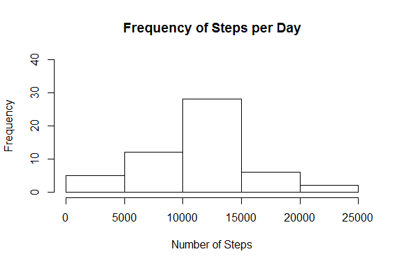
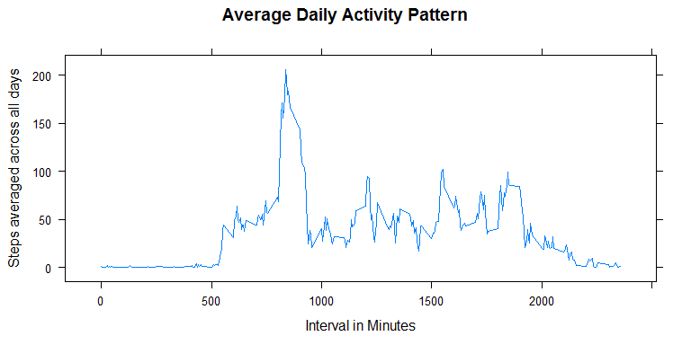
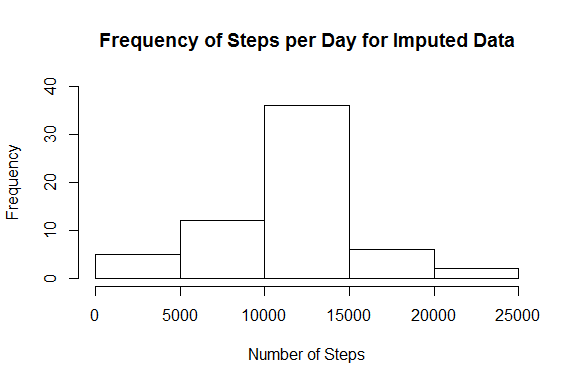
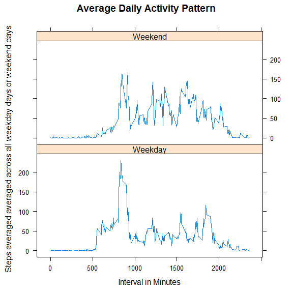

# Reproducible Research: Peer Assessment 1
### Load Library


```r
# install data wrangling package "dplyr"
library(dplyr)
```

```
## Warning: package 'dplyr' was built under R version 3.1.2
```

```
## 
## Attaching package: 'dplyr'
## 
## The following object is masked from 'package:stats':
## 
##     filter
## 
## The following objects are masked from 'package:base':
## 
##     intersect, setdiff, setequal, union
```

```r
library(lattice)
```
### Loading and preprocessing the data

```r
mydata  <- read.csv("activity.csv",sep=",",header=T,stringsAsFactors=FALSE)

# convert character into date
mydata$date <- as.Date(mydata$date, format="%Y-%m-%d")

# This function tidy up the data
tidy_data <- function(df){
  good <- complete.cases(df)
  tidy_df <- df[good,]
}

# Ignore rows with NA values
tidy_mydata <- tidy_data(mydata)
```

### Mean of total number of steps taken per day


```r
steps_by_date <- count(tidy_mydata, date, wt=steps)

# Histogram of number of steps taken per day
hist(steps_by_date$n, xlim = c(0,25000), ylim = c(0,40),  xlab ="Number of Steps", ylab = "Frequency",main="Frequency of Steps per Day")
```

 

```r
# mean of total number of steps taken per day
mean_steps_per_day <- summarise(steps_by_date, mn = mean(n))

# median of total number of steps taken per day
median_steps_per_day <- summarise(steps_by_date, mdn = median(n))
```
Mean of total number of steps taken per day 1.0766 &times; 10<sup>4</sup>.  
Median of total number of steps taken per day 10765.

### Average daily activity pattern

```r
steps_mean <- aggregate(steps ~ interval, data = tidy_mydata, FUN = mean)

xyplot(steps ~ interval, data= steps_mean,type="l",main="Average Daily Activity Pattern", ylab= "Steps averaged across all days", xlab="Interval in Minutes")
```

 

```r
# Time interval that has the maximum number of steps
row_with_max_steps <- which.max(steps_mean$steps)
 
interval_with_maxteps <- steps_mean[row_with_max_steps,]$interval
```
Time interval that has the maximum number of steps 835.

### Impute missing values


```r
#total number of missing values in the dataset
missing_values <- sum(is.na(mydata))

# Select the rows with steps equal to NA
data_with_NA <- mydata[which(is.na(mydata$steps)), ]

# replace values of steps in "data_with_NA"  with steps from "steps_mean#" by matching interval
 
for(i in data_with_NA$interval) {
  data_with_NA[which(data_with_NA$interval==i),]$steps <- steps_mean[which(steps_mean$interval==i),]$steps
}

# combine dataframes  data_with_NA with tidy_mydata
imputed_mydata <- rbind(data_with_NA,tidy_mydata)

steps_by_date_imputed <- count(imputed_mydata, date, wt=steps)
nrow(steps_by_date_imputed)
```

```
## [1] 61
```

```r
# mean of total number of steps taken per day
mean_steps_per_day_imputed <- summarise(steps_by_date_imputed, mn = mean(n))


# median of total number of steps taken per day
median_steps_per_day_imputed <- summarise(steps_by_date_imputed, mdn = median(n))
```

No of rows with missing values are 2304.  

Missing steps for an interval is replaced with mean value of steps of those same interval that has values.


```r
# Histogram of number of steps taken per day
hist(steps_by_date_imputed$n, xlim = c(0,25000), ylim = c(0,40),  xlab ="Number of Steps", ylab = "Frequency",main="Frequency of Steps per Day for Imputed Data")
```

 

Mean of total number of steps taken per day 1.0766 &times; 10<sup>4</sup>.  
Median of total number of steps taken per day 1.0766 &times; 10<sup>4</sup>.  

Mean of total number of steps taken per day is same for original datasets and imputed datasets. Median of total number of steps taken per day for imputed datasets has shifted to the right by a small amount, however.

### Differences in activity patterns between weekdays and weekends


```r
# covert dates into days
day <- weekdays(imputed_mydata$date)

# create empty vector
levels <- vector()

# Check days for weekend and weekdays and identify them vector levels
for (i in 1:nrow(imputed_mydata)) {
  if (day[i] == "Saturday" | day[i] =="Sunday") {
    levels[i] <- "Weekend"
   } else {
    levels[i] <- "Weekday"
  }
}


# factor is used to encode a vector which is character as a factor 
levels <- factor(levels)

# create a feature for levels in dataframe assign values of levels 
imputed_mydata$levels <- levels

# mean value of steps are computed for each interval which belong to either weekdays or weekends
steps_wend_week_day_mean <- aggregate(steps ~ interval + levels, data = imputed_mydata , mean)

xyplot(steps ~ interval | levels, data= steps_wend_week_day_mean,type="l", layout = c(1, 2),main="Average Daily Activity Pattern", ylab= "Steps averaged averaged across all weekday days or weekend days", xlab="Interval in Minutes")
```

 
